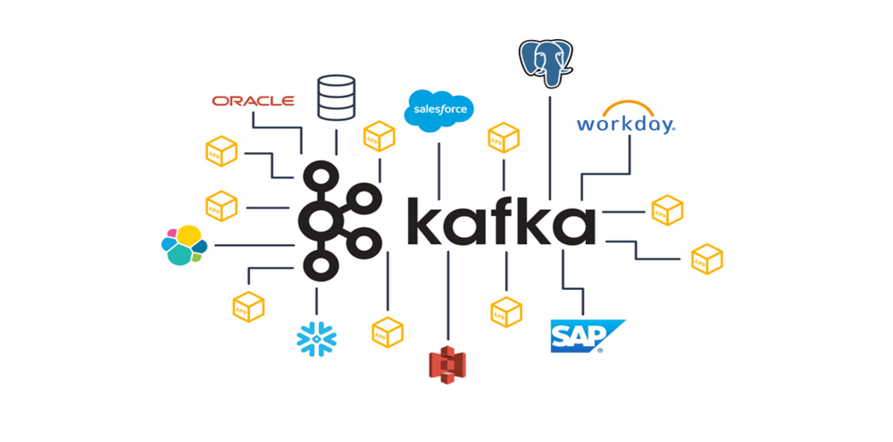
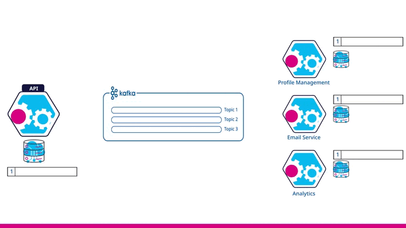

# Kafka Samples

Bu repo, Kafka'nın temel seviyede anlatımını ve proje örneklerini içermektedir. Node.js ve .NET Core teknolojilerini kullanarak hazırlanmış bir örnek proje bulunmaktadır.


## Başlangıç

Bu adımlar, projenin yerel makinenizde çalışır hale getirilmesi için gereklidir.

### Önkoşullar

Projeyi çalıştırmak için aşağıdaki yazılımların kurulu olması gerekmektedir:

- [Node.js](https://nodejs.org/)
- [.NET Core](https://dotnet.microsoft.com/download)

### Kurulum

Aşağıdaki adımları takip ederek projeyi kurabilirsiniz:

1. Repoyu klonlayın:
   ```bash
   git clone https://github.com/your-username/your-project-name.git
   ```

2. Node.js bağımlılıklarını yükleyin:
   ```bash
   cd ./Samples/SocketIoSample
   npm install
   ```

3. .NET Core projelerine ait bağımlılıkları yükleyin:
   ```bash
   dotnet restore
   ```

## Kullanım

Projeyi çalıştırmak için aşağıdaki komutları kullanabilirsiniz:

- Node.js için:
  ```bash
  npm start
  ```

- .NET Core için:
  ```bash
  dotnet run
  ```


## Lisans

Bu proje [MIT Lisansı](LICENSE) altında lisanslanmıştır.
```

Yukarıdaki düzenlemelerle, kod bloklarının düzgün bir şekilde kapatıldığına ve her adımın Markdown formatında doğru bir şekilde gösterildiğine dikkat edin. Ayrıca, Node.js ve .NET Core için linkler ekledim ki kullanıcılar doğrudan ilgili sayfalara yönlendirilebilsinler. Eğer başka bir yardıma ihtiyacınız olursa, lütfen bana bildirin!
